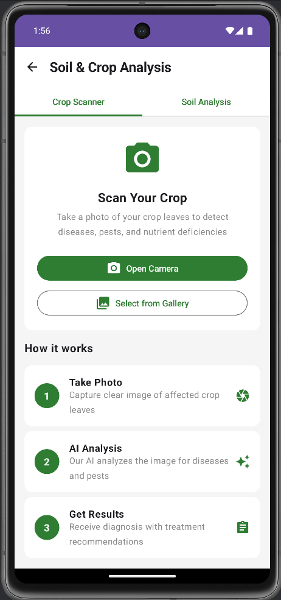
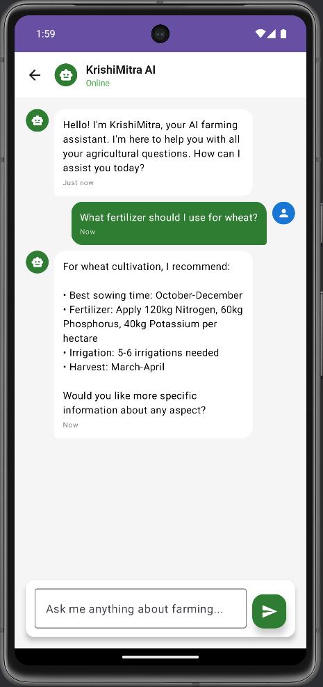

# 🌾 BharatKrishi - AI-Powered Wheat Disease Detection Platform
[](https://android.com) [](https://kotlinlang.org) [](https://sih.gov.in)
 |  | 
|:---:|:---:|:---:|
| **Dashboard & Weather** | **AI Wheat Disease Scanner** | **Voice-Enabled AI Assistant** |
## 📖 Overview
**BharatKrishi** is a comprehensive mobile app for small and marginal farmers across India, providing state-specific agricultural advisory through AI-powered wheat disease detection, real-time mandi prices, weather alerts, and multilingual voice support.
### 🎯 Problem Statement (SIH25268)
**Early Detection of Wheat Diseases** - Developing an AI/ML-based image recognition tool integrated with mobile apps to provide real-time detection, mapping, and alerts to farmers for wheat diseases including rusts, smuts, powdery mildew, blights, Black Chaff, and Barley Yellow Dwarf Virus.
## ✨ Features
- **🏠 Farmer Dashboard**: Personalized profile with land, crop history, and fertilizer tracking
- **🤖 AI Crop Scanner**: On-device TensorFlow Lite models for wheat disease detection (offline-capable)
- **🗣️ Voice AI Chatbot**: Hindi/Punjabi/regional language voice support with Speech-to-Text and Text-to-Speech
- **📊 Real-time Mandi Prices**: Live market data across states for better decision-making
- **🌤️ Weather & Rain Alerts**: State-specific forecasts with farming recommendations
- **🔬 Soil Help Section**: Soil testing guidance and fertilizer optimization
- **🤝 Advisory & NGO Connect**: Direct links to agricultural experts and support bodies
- **📚 Knowledge Hub**: Tutorials, YouTube videos, and government scheme information
## 🛠️ Prerequisites
- Android Studio Arctic Fox or later
- JDK 8 or higher
- Android SDK (API 24+)
## 🚀 Installation
1. **Clone & Open**
```bash
git clone https://github.com/sharmadecode/BharatKrishi.git
```
2. **Sync dependencies** in Android Studio
3. **Run the app** on device/emulator
## 📁 Project Structure
```
BharatKrishi/
├── app/
│   ├── src/main/
│   │   ├── java/com/bharatkrishi/app/
│   │   │   ├── MainActivity.kt                 # Main entry point
│   │   │   ├── screens/                        # UI screens
│   │   │   │   ├── HomeScreen.kt              # Dashboard with weather & alerts
│   │   │   │   ├── CropScannerScreen.kt       # AI wheat disease detection
│   │   │   │   ├── MarketPricesScreen.kt      # Real-time mandi prices
│   │   │   │   ├── WeatherForecastScreen.kt   # Detailed weather information
│   │   │   │   ├── SoilInfoScreen.kt          # Soil testing & recommendations
│   │   │   │   ├── AIChatScreen.kt            # Voice & text AI assistant
│   │   │   │   ├── ProfileScreen.kt           # Farmer profile & dashboard
│   │   │   │   ├── AdvisoryScreen.kt          # Expert advice & NGO connect
│   │   │   │   ├── KnowledgeHubScreen.kt      # Tutorials & resources
│   │   │   │   └── GPSMappingScreen.kt        # Farm boundary mapping
│   │   │   ├── viewmodels/                     # Business logic
│   │   │   │   ├── DiseaseDetectionViewModel.kt
│   │   │   │   ├── MarketPriceViewModel.kt
│   │   │   │   └── WeatherViewModel.kt
│   │   │   ├── data/                           # Data models & repositories
│   │   │   │   ├── models/
│   │   │   │   └── repositories/
│   │   │   ├── ml/                             # TensorFlow Lite integration
│   │   │   │   └── WheatDiseaseClassifier.kt
│   │   │   ├── utils/                          # Helper utilities
│   │   │   │   ├── VoiceAssistant.kt
│   │   │   │   ├── GPSManager.kt
│   │   │   │   └── NotificationHelper.kt
│   │   │   └── ui/theme/                       # App theming
│   │   │       ├── Theme.kt                   # Color schemes & dark mode
│   │   │       ├── Type.kt                    # Typography
│   │   │       └── Color.kt                   # Color palette
│   │   ├── res/
│   │   │   ├── values/
│   │   │   │   ├── strings.xml               # Multilingual string resources
│   │   │   │   └── themes.xml                # Material Design themes
│   │   │   └── drawable/                     # Icons & graphics
│   │   └── assets/
│   │       └── wheat_disease_model.tflite    # Pre-trained ML model
│   └── build.gradle.kts                       # App-level dependencies
├── build.gradle.kts                           # Project-level configuration
└── README.md
```
## 🎨 UI/UX Principles
- **Farmer-First Design**: Simple interface with large touch targets for rural users and low-end devices
- **Multilingual Voice Support**: Hindi/Punjabi/regional language voice commands with offline TFLite AI models
- **Offline-First Architecture**: Core features work without internet, syncing when connected
## 📈 Roadmap
**Phase 1** ✅ Frontend with Kotlin + Jetpack Compose  
**Phase 2** 🚧 Spring Boot backend, Firebase integration, TFLite wheat disease models  
**Phase 3** 📋 Weather/Mandi APIs, voice AI, government scheme integration  
**Phase 4** 🔮 Advanced analytics, IoT sensors, blockchain supply chain tracking
## Team name - Cartel Coders
Aditya Sharma (Leader)
---
**Made for SIH 2025 | Empowering India's Farmers with AI Technology for Wheat Disease Detection**
