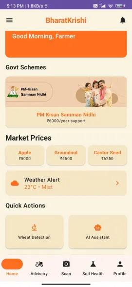
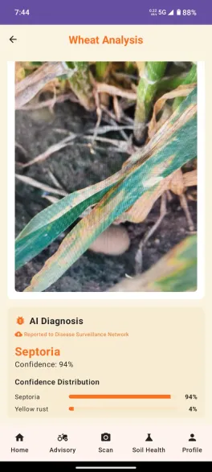
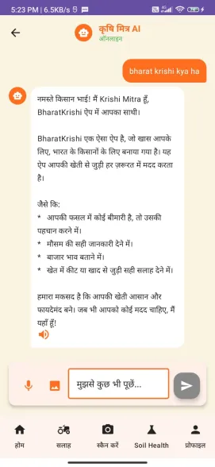
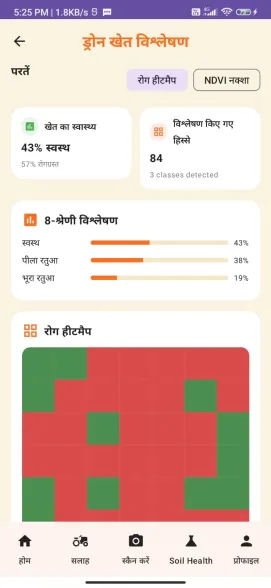
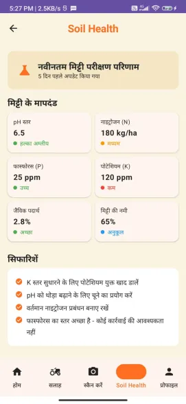
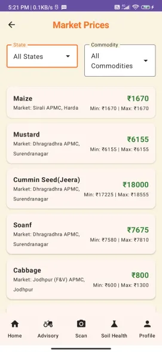
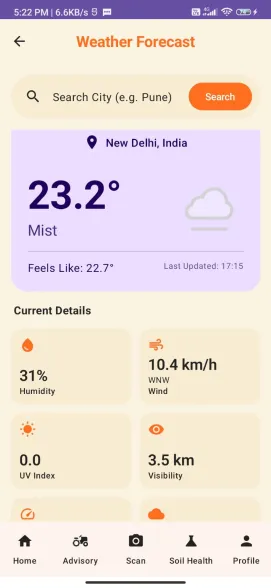
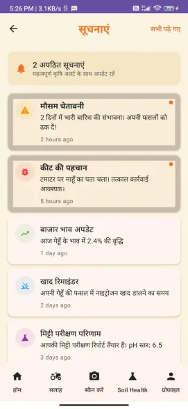
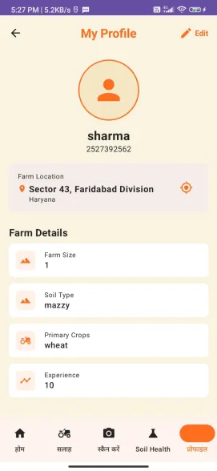

# BharatKrishi 🌾

**Revolutionizing Agriculture with Offline-First AI**

> [!NOTE]
> **🏆 SIH 2025 Finalist Project**
> **PSID: SIH25268**
> This project was a finalist in the Smart India Hackathon (SIH 2025).
>
> 📝 **Research in Progress**
> We are currently working on publishing a research paper detailing our novel MobileViT + Transformer text handling approach.

BharatKrishi is a cutting-edge Android application designed to empower farmers with advanced technology, operating completely offline. We have achieved a global first: a **fully functional Wheat Disease Detection model compressed to just 19MB**, utilizing a state-of-the-art **MobileViT + Transformer** architecture.

## 📸 Core Experience

| Home Screen | Wheat Detection | AI Assistant |
|:-----------:|:---------------:|:------------:|
|  |  |  |

## 🚀 World's First Innovations

> [!IMPORTANT]
> **19MB Disease Detection Model**
> We have successfully engineered a heavy-duty transformer model (MobileViT) to run on mobile devices with a footprint of only **19MB**. This is an industry-first achievement, enabling advanced AI on low-end devices without internet.

- **⚡ Blazing Fast Performance**: Delivers disease diagnosis results in **under 1 millisecond**.
- **🔌 100% Offline Capability**: Detection works anywhere, anytime—no data connection required.
- **🧠 Hybrid Architecture**: Combines the spatial precision of CNNs with the global context of Transformers (MobileViT) for superior accuracy.

## 📱 Key Features

### 🔍 AI Wheat Disease Detection
- **Instant Diagnosis**: Detects 8+ classes of wheat diseases (Yellow Rust, Brown Rust, etc.) instantly.
- **Offline Inference**: Powered by ONNX Runtime, ensuring privacy and speed.
- **Smart Remediation**: Provides immediate, actionable advisory for detected issues.

### 🤖 WhatsApp In-Device Bot (New!)
- **Chat-Based Diagnosis**: Farmers can simply send a photo of their crop to our WhatsApp bot.
- **Instant Classification**: The bot processes the image and returns a detailed disease diagnosis and treatment plan within seconds.
- **Easy Access**: No need to open the app; works directly within the familiar WhatsApp interface.

### 🤖 KrishiMitra AI Assistant
- **Bilingual Support**: Chat in Hindi or English.
- **Context-Aware**: Asks generalized questions about farming, weather, and government schemes.
- **Voice-Enabled**: Speak to the AI for hands-free interaction.

### 🚁 Drone Field Analysis
- **Full Field Mapping**: Generates disease heatmaps and NDVI analysis for entire fields.
- **Precision Agriculture**: Identifies specific patches needing attention, reducing chemical usage.

### 🛠️ Comprehensive Farmer Tools
- **🌤️ Weather Forecasting**: Real-time accurate weather updates and alerts.
- **💰 Market Prices (Mandi Bhav)**: Live crop prices from nearby markets.
- **📜 Government Schemes**: One-tap access to latest agricultural subsidies and beneficiary schemes.
- **🚜 Soil Health**: Logs and tracks soil parameters (N-P-K, pH) over time.

---


---

## ⚙️ How to Run Locally

This project uses **secure API key management**. To run the full app with all cloud features (AI Chat, Weather, Market), you need to configure your own keys.

1.  **Clone the Repo**
2.  **Create `local.properties`** in the root directory (if not exists).
3.  **Add your keys**:
    ```properties
    GEMINI_API_KEY=your_gemini_key
    MAPS_API_KEY=your_google_maps_key
    WEATHER_API_KEY=your_weather_api_key
    MARKET_API_KEY=your_market_api_key
    ```
4.  **Sync Gradle** & Run!

> **Note**: The **Wheat Disease Detection** (Core Feature) works **100% Offline** and requires **NO KEYS** to test! 🚀

---

## 🏗️ Project Structure & Tech Stack

**Frontend**:
- **Kotlin & Jetpack Compose**: Modern, reactive UI toolkit for building native Android UIs.
- **Material 3 Design**: Utilizing the latest Google design principles for a premium, accessible aesthetic.

**Machine Learning**:
- **Framework**: PyTorch trained, exported to **ONNX**.
- **Architecture**: MobileViT (Mobile Vision Transformer).
- **Optimization**: Quantized and optimized for mobile edge inference (19MB total).

**Backend**:
- **Firebase**: User authentication and real-time database.
- **Spring Boot (Microservices)**: Scalable backend for diverse agricultural data services.

**UI/UX Principles**:
- **Accessibility First**: High contrast, large touch targets, and voice support for rural accessibility.
- **Visual Feedback**: Skeleton loaders, shimmer effects, and seamless transitions for a premium feel.
- **Localized**: Full support for Hindi and English.

---

## 👨‍💻 Creator & Lead

**Aditya Sharma** (Finalist & Team Lead)
*Role: Full Stack + AI/ML*
*Focus: Android, Web, AI Model Optimization*

---

## 📸 More Features

| Drone Analysis | Soil Health | Market Prices |
|:--------------:|:-----------:|:-------------:|
|  |  |  |

| Weather Alerts | Gov Schemes | User Profile |
|:--------------:|:-----------:|:------------:|
|  |  |  |
