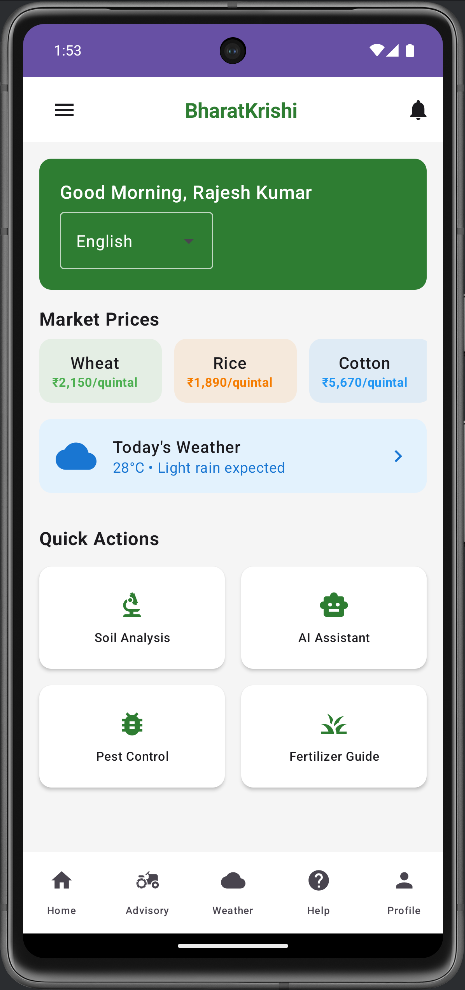

# 🌾 BharatKrishi - Smart Crop Advisory System

[](https://android.com) [](https://kotlinlang.org) [](https://sih.gov.in)

 |  | 
|:---:|:---:|:---:|
| **Dashboard & Weather** | **AI Crop Disease Scanner** | **Voice-Enabled AI Assistant** |

## 📖 Overview
**BharatKrishi** is a comprehensive mobile app for small and marginal farmers, providing Punjab-specific agricultural advisory through AI-powered crop disease detection, real-time mandi prices, weather alerts, and multilingual voice support.

### 🎯 Problem Statement (SIH25010)
**Smart Crop Advisory System for Small and Marginal Farmers** - Developing an end-to-end digital solution that combines AI-driven crop management, local language support, and government/NGO integration for sustainable farming practices.

## ✨ Features

- **🏠 Farmer Dashboard**: Personalized profile with land, crop history, and fertilizer tracking
- **🤖 AI Crop Scanner**: On-device TensorFlow Lite models for crop disease detection (offline-capable)
- **🗣️ Voice AI Chatbot**: Punjabi/Hindi voice support with Speech-to-Text and Text-to-Speech
- **📊 Real-time Mandi Prices**: Live market data for better decision-making
- **🌤️ Weather & Rain Alerts**: Punjab-specific forecasts with farming recommendations
- **🔬 Soil Help Section**: Soil testing guidance and fertilizer optimization
- **🤝 Advisory & NGO Connect**: Direct links to agricultural experts and support bodies
- **📚 Knowledge Hub**: Tutorials, YouTube videos, and government scheme information

## 🛠️ Prerequisites
- Android Studio Arctic Fox or later
- JDK 8 or higher
- Android SDK (API 24+)

## 🚀 Installation

1. **Clone & Open**
```bash
git clone https://github.com/yourusername/bharatkrishi-android.git
```
2. **Sync dependencies** in Android Studio
3. **Run the app** on device/emulator

## 📁 Project Structure
```
app/src/main/java/com/bharatkrishi/app/
├── MainActivity.kt              # Navigation setup
├── screens/                     # All UI screens
│   ├── HomeScreen.kt           # Dashboard
│   ├── SoilInfoScreen.kt       # Crop scanner
│   ├── AIChatScreen.kt         # Voice/text chatbot
│   └── [other screens...]
└── ui/theme/                   # App theming
```

## 🎨 UI/UX Principles
- **Farmer-First Design**: Simple interface with large touch targets for rural users and low-end devices
- **Multilingual Voice Support**: Punjabi/Hindi voice commands with offline TFLite AI models
- **Offline-First Architecture**: Core features work without internet, syncing when connected

## 📈 Roadmap

**Phase 1** ✅ Frontend with Kotlin + Jetpack Compose  
**Phase 2** 🚧 Spring Boot backend, Firebase integration, TFLite crop disease models  
**Phase 3** 📋 Weather/Mandi APIs, voice AI, government scheme integration  
**Phase 4** 🔮 Advanced analytics, IoT sensors, blockchain supply chain tracking

## 👥 Team - Cartel Coders
Aditya Sharma • Adarsh Mishra • Parmanshu Singh Patel • Saksham Tyagi • Piyush Tiwari • Dimple

---
**Made for SIH 2025 | Empowering Punjab's Farmers with AI Technology**